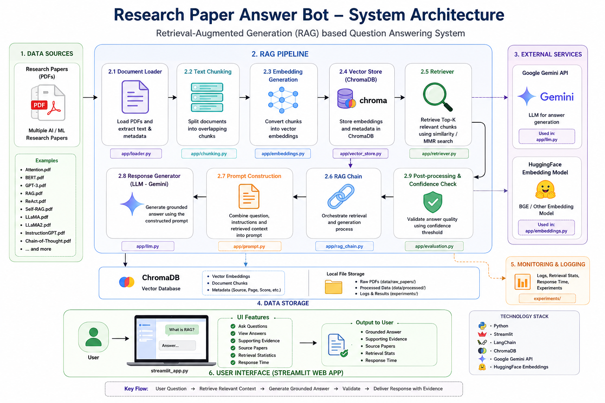
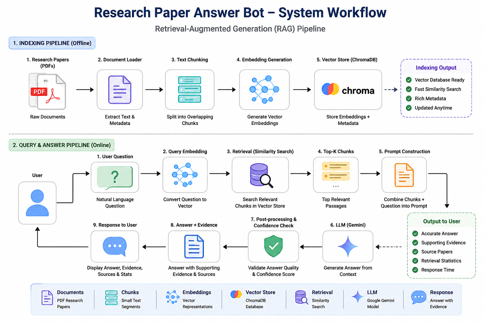

<div align="center">

# 📚 Research Paper Answer Bot

### AI-Powered Research Paper Question Answering using Retrieval-Augmented Generation (RAG)

An intelligent question-answering system that retrieves relevant information from research papers using **LangChain**, **ChromaDB**, **HuggingFace Embeddings**, and **Google Gemini**, delivered through an interactive **Streamlit** interface.

</div>

<div align="center">

        

</div>

<div align="center">

[](YOUR_STREAMLIT_URL) [](docs/user_manual.md) [](docs/evaluation.md)

</div>

---

# 📑 Table of Contents

- [Overview](#-overview)
- [Key Features](#-key-features)
- [Project Structure](#project-structure)
- [System Architecture](#-system-architecture)
- [Workflow](#-workflow)
- [Technology Stack](#-technology-stack)
- [Installation](#-installation)
- [Environment Configuration](#-environment-configuration)
- [Building the Vector Database](#-building-the-vector-database)
- [Running the Application](#-running-the-application)
- [Example Questions](#-example-questions)
- [Evaluation](#-evaluation)
- [Testing](#-testing)
- [Screenshots](#-screenshots)
- [Documentation](#-documentation)
- [Roadmap](#-roadmap)
- [Contributing](#-contributing)
- [License](#-license)
- [Acknowledgements](#-acknowledgements)
- [Support](#-support)

---

## 📖 Overview

Large Language Models (LLMs) are powerful but may produce hallucinated or outdated answers when responding from their internal knowledge alone.

This project addresses that limitation by implementing a **Retrieval-Augmented Generation (RAG)** pipeline. Instead of relying only on the language model, the system first retrieves the most relevant passages from a collection of indexed research papers and then generates answers based solely on those retrieved documents.

The application is designed for researchers, students, developers, and AI enthusiasts who want reliable answers supported by research paper evidence.

---

# ✨ Features

- 📄 PDF Research Paper Loader
- ✂️ Intelligent Document Chunking
- 🔍 Semantic Search using ChromaDB
- 🤖 Google Gemini Integration
- 🧠 HuggingFace BGE Embeddings
- 📚 Retrieval-Augmented Generation (RAG)
- 🎯 Similarity & MMR Retrieval
- ✅ Confidence-based Answer Validation
- 📑 Supporting Evidence Viewer
- 📖 Referenced Research Papers
- 📊 Retrieval Statistics (Debug Mode)
- ⚡ Streamlit Interactive Interface
- 🧩 Modular Architecture
- 🔄 Easily Extendable Knowledge Base

---

# 🚀 Technologies Used

### Programming Language

- Python 3.11+

### Frameworks & Libraries

- Streamlit
- LangChain
- ChromaDB
- HuggingFace Transformers
- Sentence Transformers
- PyPDF
- Python Dotenv

### AI Models

- Google Gemini
- BAAI BGE Embedding Model

### Vector Database

- ChromaDB

---

# ⚙️ Installation

## 1. Clone the Repository

```bash
git clone https://github.com/SANJAI-s0/Research-Paper-Answer-Bot.git
```

---

## 2. Navigate to the Project

```bash
cd Research-Paper-Answer-Bot
```

---

## 3. Create a Virtual Environment

Windows

```bash
python -m venv .venv
```

Linux/macOS

```bash
python3 -m venv .venv
```

---

## 4. Activate the Virtual Environment

Windows

```bash
.venv\Scripts\activate
```

Linux/macOS

```bash
source .venv/bin/activate
```

---

## 5. Install Dependencies

```bash
pip install -r requirements.txt
```

---

# 🔑 Environment Configuration

Create a `.env` file in the project root.

Example:

```env
GOOGLE_API_KEY=YOUR_GOOGLE_API_KEY
HF_TOKEN=YOUR_HUGGINGFACE_TOKEN
MODEL_NAME=gemini-flash-latest
```

---

# 🗂️ Build the Vector Database

Before running the application, index the research papers.

```bash
python build_vector_db.py
```

This process:

- Loads PDF research papers
- Splits documents into chunks
- Creates embeddings
- Stores vectors in ChromaDB

---

# ▶️ Run the Application

```bash
streamlit run streamlit_app.py
```

Open:

```
http://localhost:8501
```

---

# 💬 Example Questions

You can ask questions such as:

```
What is Retrieval-Augmented Generation?

Explain Chain-of-Thought Prompting.

What is Self-RAG?

Compare GPT-3 and BERT.

Explain the ReAct framework.

What are the advantages of Instruction Tuning?

Explain the LLaMA 2 architecture.
```

---

# 🧠 How It Works

The application follows a Retrieval-Augmented Generation workflow.

1. User enters a question.
2. The question is converted into an embedding.
3. ChromaDB retrieves the most relevant document chunks.
4. Confidence filtering validates retrieval quality.
5. Retrieved passages are sent to Google Gemini.
6. Gemini generates a grounded response.
7. Supporting evidence and source papers are displayed.

---

# 📊 Evaluation

The project includes utilities for evaluating retrieval quality and answer generation.

Run:

```bash
python evaluate_rag.py
```

The evaluation process examines:

- Retrieval quality
- Context relevance
- Grounded answer generation
- Confidence filtering
- Retrieval consistency

---

# 🧪 Testing

Individual modules can be tested using the scripts available in the `tests` directory.

Example:

```bash
python tests/test_loader.py
```

```bash
python tests/test_chunking.py
```

```bash
python tests/test_retriever.py
```

```bash
python tests/test_rag.py
```

---

## 📈 Project Status

| Status | Version | Release |
|----------|----------|----------|
| ✅ Stable | v1.0.0 | Initial Release |

---

# 🛠️ Technology Stack

| Category | Technology |
|----------|------------|
| Programming Language | Python |
| Frontend | Streamlit |
| LLM | Google Gemini |
| Framework | LangChain |
| Embedding Model | HuggingFace BGE |
| Vector Database | ChromaDB |
| PDF Processing | PyPDF |
| Environment | Python Virtual Environment |

---

<!-- Structure -->
# Project Structure

```tree
Research-Paper-Answer-Bot/
│
├── .git/                                 # Git version control metadata (auto-generated)
├── .github/                              # GitHub workflows, issue templates, and CI (optional)
│
├── app/                                  # Core application source code
│   ├── __init__.py                       # Marks 'app' as a Python package
│   ├── chunking.py                       # Splits research papers into semantic chunks
│   ├── config.py                         # Stores project configuration, constants, and API settings
│   ├── embeddings.py                     # Loads and manages HuggingFace embedding models
│   ├── evaluation.py                     # Evaluation helper functions for retrieval and answers
│   ├── llm.py                            # Handles Gemini API communication and answer generation
│   ├── loader.py                         # Loads PDF files and extracts document text
│   ├── prompt.py                         # Stores prompt templates for the language model
│   ├── rag_chain.py                      # Implements the complete Retrieval-Augmented Generation pipeline
│   ├── retriever.py                      # Retrieves relevant document chunks from ChromaDB
│   ├── utils.py                          # Common helper and utility functions
│   ├── vector_store.py                   # Creates and manages the Chroma vector database
│   └── __pycache__/                      # Python bytecode cache (ignored by Git)
│
├── data/                                 # Project datasets and vector database
│   ├── raw_papers/                       # Original research paper PDF files
│   ├── processed/                        # Processed intermediate files (optional)
│   └── chroma_db/                        # Persistent ChromaDB vector database (excluded from Git)
│
├── docs/                                 # Project documentation
│   ├── screenshots/                      # Application screenshots for README and report
│   ├── Flow/architecture.png             # High-level system architecture diagram
│   ├── Flow/workflow.png                 # RAG workflow diagram
│   ├── Flow/architecture_workflow.svg    # High-Level Overall Architecture and Work Flow Diagram
│   ├── deployment.md                     # Deployment guide
│   ├── evaluation.md                     # Evaluation methodology and results
│   ├── user_manual.md                    # End-user guide
│   └── Problem/architecture_workflow.svg # Problem Statement
│
├── experiments/                          # Experimental results and benchmarking
│   ├── experiment_log.csv                # Experiment logs
│   ├── embedding_comparison.csv          # Embedding model comparison results (recommended)
│   └── evaluation_results.csv            # Final evaluation metrics (recommended)
│
├── notebooks/                            # Development notebooks
│   └── Research_Paper_Answer_Bot.ipynb   # Research, experiments, and prototype notebook
│
├── tests/                                # Testing scripts
│   ├── test_loader.py                    # Tests PDF loading
│   ├── test_chunking.py                  # Tests text chunking
│   ├── test_retriever.py                 # Tests retrieval quality
│   ├── test_rag.py                       # End-to-end RAG pipeline tests
│   ├── list_models.py                    # Lists available embedding and LLM models
│   └── quota_checking.py                 # Checks Gemini API quota
│
├── .streamlit/                           # Streamlit configuration
│   └── config.toml                       # Streamlit theme and server configuration
│
├── .env                                 # Environment variables (never commit)
├── .env.example                         # Example environment variable template
├── .gitignore                           # Files and folders ignored by Git
├── LICENSE                              # Open-source license (MIT recommended)
├── CHANGELOG.md                         # Project version history
├── CONTRIBUTING.md                      # Contribution guidelines
├── CODE_OF_CONDUCT.md                   # Community code of conduct (optional)
├── README.md                            # Project overview and setup guide
├── structure.md                         # Explains the project folder structure
├── requirements.txt                     # Python dependencies
├── build_vector_db.py                   # Builds ChromaDB from PDF documents
├── compare_embeddings.py                # Compares embedding model performance
├── evaluate_rag.py                      # Evaluates the complete RAG system
├── streamlit_app.py                     # Main Streamlit application
└── run.py                               # Optional launcher script for the application
```

---

# 🏗️ System Architecture

<p align="center">

</p>

---

# 🔄 Workflow

<p align="center">

</p>

---

# 📷 Screenshots

Application screenshots are available in the `docs/screenshots/` directory.

Included screenshots:

- System Architecture
- RAG Workflow

---

# 📚 Documentation

Additional documentation is available inside the `docs/` directory.

- User Manual
- Deployment Guide
- Evaluation Report

The project structure is documented separately in `structure.md`.

---

# ⚠️ Limitations

Current limitations include:

- Answers are limited to indexed research papers.
- Internet search is not supported.
- Performance depends on embedding quality and retrieval accuracy.
- Images and figures inside PDFs are not interpreted.

---

# 🚀 Future Enhancements

Planned improvements include:

- Hybrid Search (BM25 + Vector Search)
- Conversation Memory
- PDF Upload via UI
- Citation Highlighting
- REST API
- Docker Support
- Authentication
- Cloud Deployment Templates
- Multi-document Comparison

---

# 🤝 Contributing

Contributions are welcome.

Please read:

- `CODE_OF_CONDUCT.md`
- `CONTRIBUTING.md`

before submitting issues or pull requests.

---

# 📄 License

This project is licensed under the **MIT License**.

See the `LICENSE` file for details.

---

# 🚀 Roadmap

- [x] PDF Loader
- [x] Text Chunking
- [x] ChromaDB Integration
- [x] Semantic Search
- [x] Google Gemini Integration
- [x] Streamlit Interface
- [x] Confidence Filtering
- [x] Supporting Evidence Viewer
- [ ] Conversation Memory
- [ ] Hybrid Search (BM25 + Vector)
- [ ] PDF Upload
- [ ] REST API
- [ ] Docker Deployment
- [ ] Authentication

---

## 📊 Repository Information

| Item | Details |
|------|---------|
| Project | Research Paper Answer Bot |
| Version | 1.0.0 |
| Language | Python |
| Architecture | Retrieval-Augmented Generation (RAG) |
| License | MIT |
| UI | Streamlit |
| Status | Stable |

---

# 🙏 Acknowledgements

This project makes use of several excellent open-source tools and technologies.

- Google Gemini
- LangChain
- ChromaDB
- HuggingFace
- Streamlit
- PyPDF

Special thanks to the open-source community for providing the tools and resources that made this project possible.

---

# ⭐ Support

If you found this project useful:

- ⭐ Star the repository
- 🍴 Fork the project
- 🐛 Report issues
- 💡 Suggest new features

Your feedback and contributions are greatly appreciated.

---

<div align="center">

### ⭐ If you found this project useful, consider giving it a star!

Made with ❤️ using Python, LangChain, ChromaDB, Google Gemini, and Streamlit.

</div>
